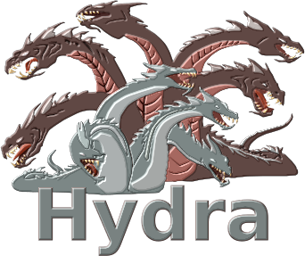

Hydra is a a light-weight library for building distributed computing applications - such as microservices. 
It was announced at [EmpireNode 2016](http://empirenode.org/).

A key goal in Hydra is to simplify building Node-based distributed applications.

Rather watch a video - than read the docs? See our [Introduction to Hydra](https://www.youtube.com/watch?v=dHFQxrc4Fnk) video on YouTube.

> Hydra replies on an instance of Redis, if you need to learn more about Redis, see our [Redis quick start guide](https://youtu.be/eX7EamF_WuA).

If you're just getting started with Node Microservices and you have ExpressJS experience you should first look at our [HydraExpress](https://github.com/flywheelsports/fwsp-hydra-express) project.

### Documentation

Read the [Full documentation](documentation.md)

### Related projects

* [Hydra](https://github.com/flywheelsports/fwsp-hydra): hydra core project for use with Non-ExpressJS apps
* [Hydra-cli](https://github.com/flywheelsports/hydra-cli): a hydra commandline client for interacting with Hydra-enabled applications
* [Hydra Geneartor](https://github.com/flywheelsports/generator-fwsp-hydra): A Yeoman generator for quickly building hydra-based projects
* [Hydra-Router](https://github.com/flywheelsports/fwsp-hydra-router): A service-aware socket and HTTP API router
* [UMF](https://github.com/cjus/umf): Universal Message Format, a messaging specification for routable messages
* [Hydra-Cluster](https://github.com/cjus/hydra-cluster): A compute cluster based on Hydra
* [Other Flywheel Sports open source projects](https://github.com/flywheelsports)
